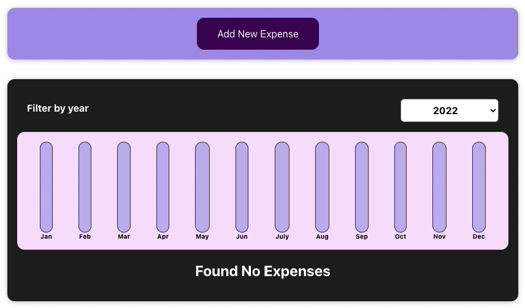
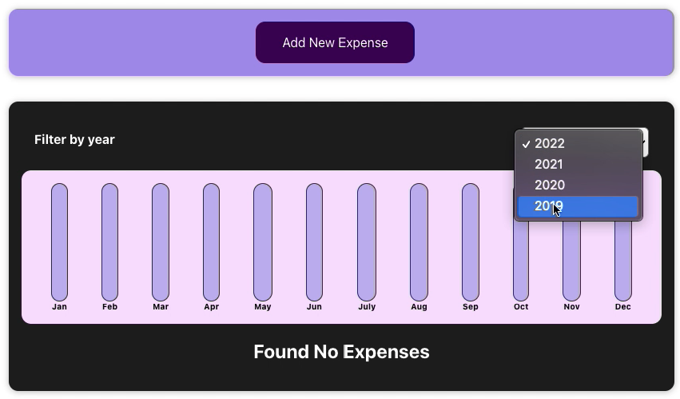
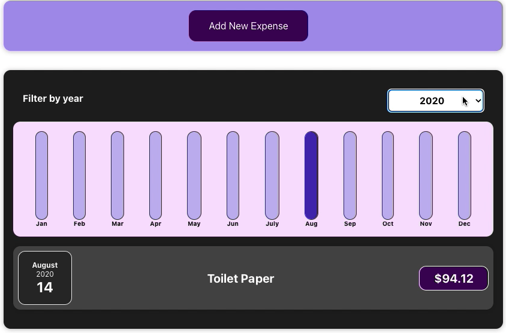
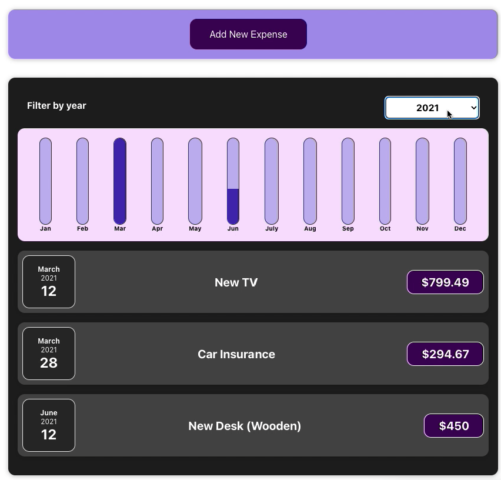
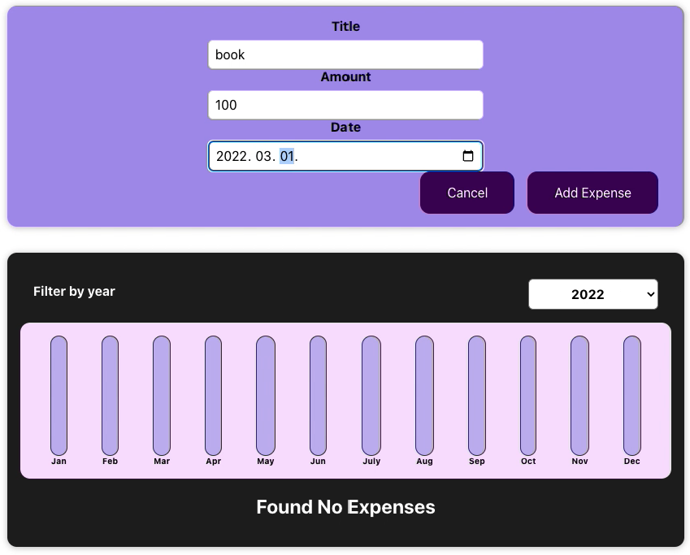
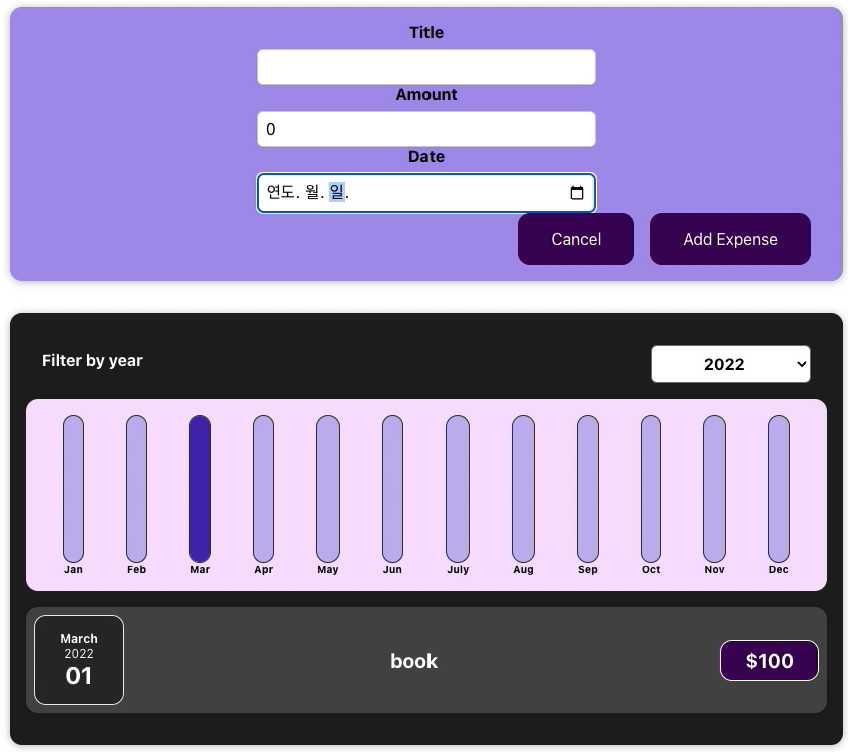

# Account Book

* #### writer : crystal Lee

* #### written at : 2022-04 

* #### source : [Udemy] React Perfect Guide Sec.4

---

* <strong>Skills</strong>
    * React 

 

* <strong>What I learn</strong>
    * useState 

 

* <strong>Features</strong>
    1. Add New Expense Form 
        * hit [Add New Expense] button to fill in the form
        * hit [Cancel] button to close the form
        * Input Validator
    2. Expenses List
        * Graph by Month
        * Filter by Year
        * Expenses Details

  
  
  
  
  
  